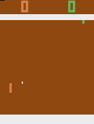

📄 Conteúdo sugerido (copie e cole)
# 🏓 Pong RL Agent (PPO + Atari)

Agente de Reinforcement Learning treinado para jogar **Pong (Atari)** usando **PPO (Proximal Policy Optimization)** com **Stable-Baselines3** e **Gymnasium ALE**.

## 🎮 Demonstração



## 🧠 Tecnologias
- Python 3.11
- Gymnasium + ALE (Atari)
- Stable-Baselines3 (PPO)
- PyTorch
- ImageIO
- Git + GitHub

## ⚙️ Instalação

```bash
pip install gymnasium ale-py stable-baselines3 torch imageio

🏃 Treinamento
python train_pong.py


O modelo treinado será salvo em:

models/ppo_pong_1M.zip

👀 Avaliação (visual)
python eval_pong.py

🎥 Gravar GIF
python record_pong.py


O GIF será salvo em:

docs/pong_demo.gif

📊 Resultado

Após ~1M de timesteps, o agente aprende a:

Reagir à bola

Defender e atacar

Manter rallies longos

🚀 Próximos passos

Treinar mais timesteps (5M+)

Testar outros jogos Atari

Adicionar CNN customizada

Publicar artigo ou vídeo demo


